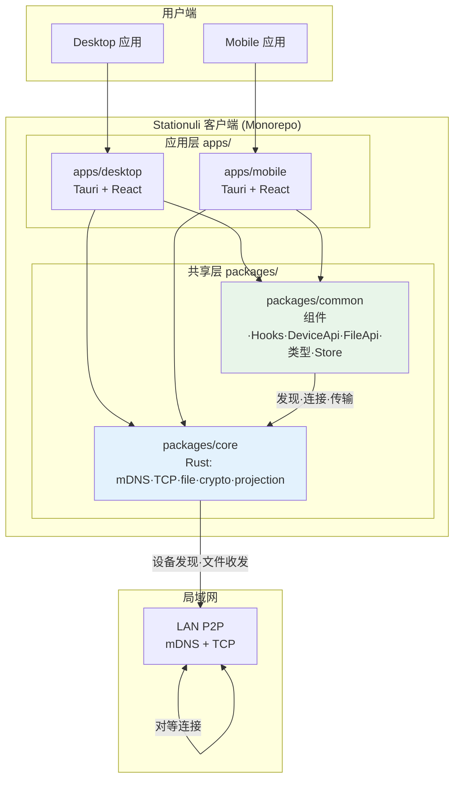
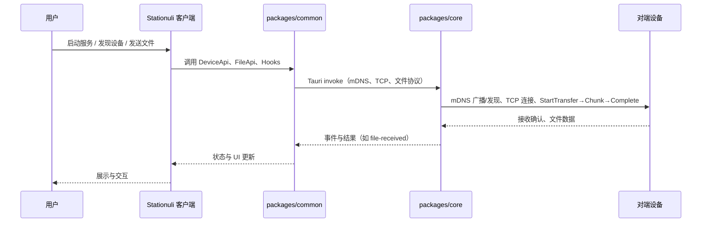
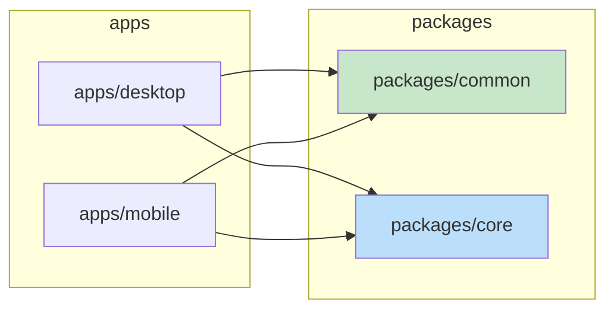
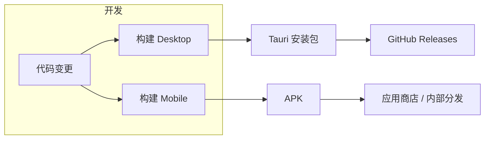
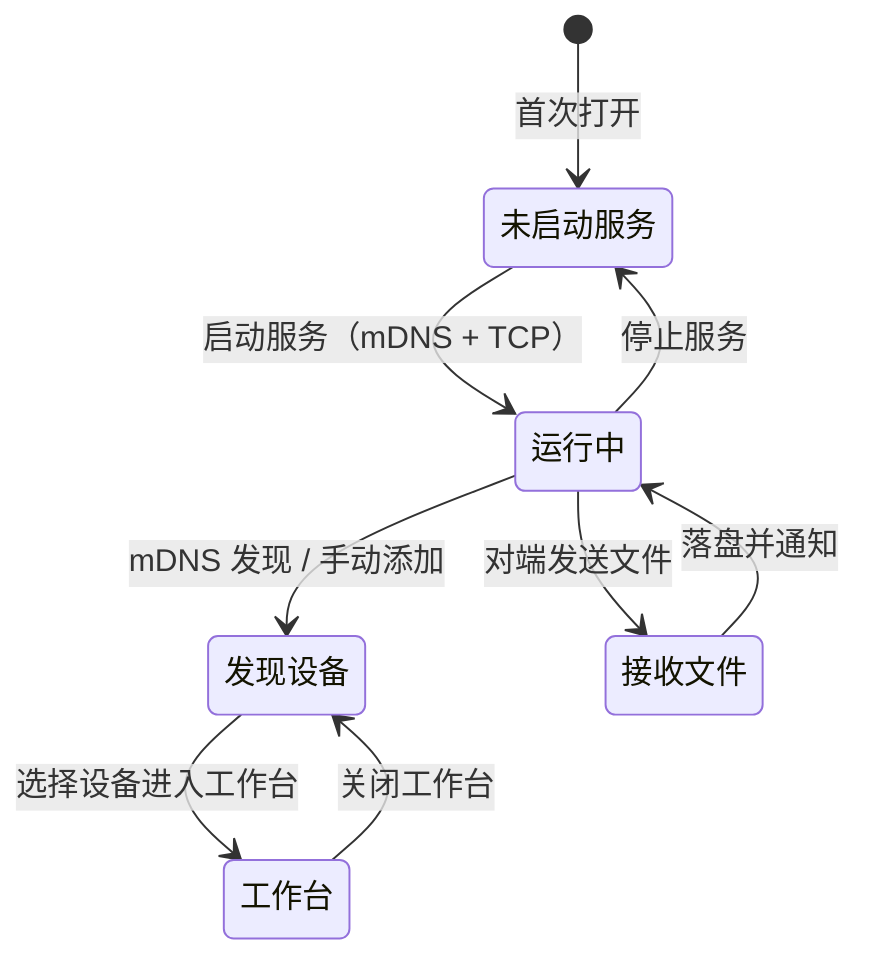

# Stationuli 整体系统设计

## 目录

- [一、方案概述](#一方案概述)
- [二、专业术语](#二专业术语)
- [三、系统架构设计](#三系统架构设计)
- [四、模块与职责](#四模块与职责)
- [五、数据流与存储](#五数据流与存储)
- [六、技术栈与平台能力](#六技术栈与平台能力)
- [七、部署与构建形态](#七部署与构建形态)
- [八、与设计文档及 CI/CD 的衔接](#八与设计文档及-cicd-的衔接)
- [九、扩展与演进](#九扩展与演进)
- [十、附录](#十附录)

---

## 一、方案概述

### 1.1 目标

为 **Stationuli** 项目建立一套**整体系统设计说明**，用于：

- **统一认知**：产品、前端、Rust 核心、多端开发对系统边界、模块划分、数据流形成一致理解。
- **指导实现**：与 [01-product](../01-product/) 下的 PRD 及 [02-design](./README.md) 下的各专项设计文档配合，指导开发与排期。
- **对外展示**：便于文档站、Wiki、新成员入职时快速把握系统全貌。

### 1.2 设计原则

- **多端一致**：Desktop、Mobile 在业务能力与体验上尽量一致，通过 `packages/common` 与平台适配层（DeviceApi/FileApi）实现「一套逻辑、双端运行」。
- **完全离线**：不依赖任何第三方业务服务；设备发现与文件传输均在局域网内通过 mDNS 与 TCP 完成，无中心服务器、无云端账号。
- **安全与隐私**：端到端加密采用 X25519 + AES-256（设计已声明，实现依版本）；本机 IP、设备 ID 等仅用于本地与 P2P，不向非用户指定服务上传。
- **可扩展**：核心能力（发现、传输、加密、投影）在 `packages/core` 中模块化；新增能力优先在 common 中补充类型与接口，再在各端实现。

### 1.3 系统定位

| 维度         | 说明                                                                                            |
| ------------ | ----------------------------------------------------------------------------------------------- |
| **产品定位** | 个人工作站 P2P 文件传输与控制：以局域网为范围，支持设备发现、文件传输及后续的消息、投影、控制。 |
| **目标用户** | 个人开发者、技术爱好者、家庭/小团队，需要多设备间快速、私密、离线的文件与数据交换。             |
| **核心价值** | 完全自主、完全离线、完全私密；数据仅在用户设备间传输。                                          |

---

## 二、专业术语

### 2.1 架构与工程术语

| 术语           | 英文             | 说明                                                                                    |
| -------------- | ---------------- | --------------------------------------------------------------------------------------- |
| **Monorepo**   | Monorepo         | 单一仓库内管理多个应用与共享包，Stationuli 使用 pnpm workspace 管理 apps、packages      |
| **共享包**     | Shared Package   | 被多应用引用的包，如 `packages/common`（前端共享）、`packages/core`（Rust 核心库）      |
| **平台适配层** | Platform Adapter | 抽象平台差异的接口与实现（如 DeviceApi、FileApi），使同一业务逻辑在 Desktop/Mobile 复用 |
| **工作台**     | Workbench        | 针对单台设备的整合界面，含文件传输、消息、控制、投影等（当前以文件传输为主）            |

### 2.2 网络与传输术语

| 术语           | 英文          | 说明                                                     |
| -------------- | ------------- | -------------------------------------------------------- |
| **P2P**        | Peer-to-Peer  | 点对点通信，本项目中指局域网内设备直连，无经第三方服务器 |
| **mDNS**       | Multicast DNS | 组播 DNS，用于局域网内设备发现与服务注册                 |
| **DeviceApi**  | Device API    | common 中定义的设备发现、列表、添加、测试连接等接口抽象  |
| **FileApi**    | File API      | common 中定义的文件选择、发送、接收、另存等接口抽象      |
| **EmptyState** | Empty State   | 未启动服务时的引导页，仅保留「启动服务」等关键操作       |

### 2.3 传输协议术语

| 术语               | 说明                                               |
| ------------------ | -------------------------------------------------- |
| **StartTransfer**  | 文件传输协议消息：开始一次传输，携带文件名、大小等 |
| **Chunk**          | 文件分片消息，大文件按块（如 1MB）传输             |
| **Complete**       | 文件传输完成消息                                   |
| **received_files** | 应用数据目录下存放接收文件的子目录                 |

### 2.4 部署与制品术语

| 术语        | 英文           | 说明                                                      |
| ----------- | -------------- | --------------------------------------------------------- |
| **Desktop** | Desktop        | 基于 Tauri + React 的桌面应用，支持 Windows、macOS        |
| **Mobile**  | Mobile         | 基于 Tauri + React 的移动应用，支持 Android（iOS 规划中） |
| **制品**    | Build Artifact | 构建产物（如 Desktop 安装包、Mobile APK），用于发布       |

---

## 三、系统架构设计

### 3.1 整体架构图



### 3.2 分层说明

| 层级       | 含义               | 主要产物                                                |
| ---------- | ------------------ | ------------------------------------------------------- |
| **用户端** | 用户使用的运行环境 | 桌面窗口、移动设备                                      |
| **应用层** | 各端入口应用       | `apps/desktop`、`apps/mobile`                           |
| **共享层** | 跨端复用代码与能力 | `packages/common`（前端）、`packages/core`（Rust 核心） |
| **局域网** | 通信范围           | 设备间 mDNS 发现与 TCP 直连，无公网依赖                 |

### 3.3 核心数据流（简化）



---

## 四、模块与职责

### 4.1 仓库目录与模块映射

| 路径                | 模块名称    | 职责简述                                                                                                                                                            |
| ------------------- | ----------- | ------------------------------------------------------------------------------------------------------------------------------------------------------------------- |
| **apps/desktop**    | 桌面端应用  | Tauri 2.0 + React + Vite；服务启停、设备列表、工作台、文件发送/接收、首页/设备/历史/设置；通过 common 与 core 实现业务与网络能力。                                  |
| **apps/mobile**     | 移动端应用  | Tauri 2.0 + React + Vite；与 Desktop 共享业务逻辑与 UI 抽象；移动端适配（如 content URI、底栏导航）。                                                               |
| **packages/common** | 跨端共享库  | 组件（ServiceStatusCard、DeviceCard、AddDeviceDialog、ReceivedFilesCard 等）、Hooks（useDiscovery、useFileTransfer）、DeviceApi/FileApi 抽象、类型、Zustand Store。 |
| **packages/core**   | Rust 核心库 | mDNS 注册与发现、TCP 监听与连接、文件分片与传输协议（StartTransfer/Chunk/Complete）、断点续传结构、加密（X25519、AES-256）、投影模块。                              |

### 4.2 应用层与共享层依赖关系



- **apps/desktop**、**apps/mobile** 均依赖 **common**（UI、状态、API 抽象）与 **core**（发现、传输、加密等）。
- 各端通过 **Adapter** 实现 DeviceApi、FileApi（如 Tauri `invoke` 调用 core），UI 通过 variant（desktop/mobile）区分样式与布局。

### 4.3 平台能力矩阵（与 PRD 一致）

| 能力                                        | Desktop   | Mobile    |
| ------------------------------------------- | --------- | --------- |
| 服务启停（mDNS + TCP）                      | ✅        | ✅        |
| 本机信息展示、mDNS 发现、手动添加设备       | ✅        | ✅        |
| 设备列表搜索与筛选、测试连接                | ✅        | ✅        |
| 选择并发送文件（多选）、接收列表与另存/删除 | ✅        | ✅        |
| 工作台（按设备 + 文件传输）                 | ✅        | ✅        |
| 首页 / 设备页 / 历史页 / 设置页             | ✅        | ✅        |
| 操作日志 / 传输历史                         | ❌ 待实现 | ❌ 待实现 |
| 工作台内文本消息、设备投影/控制             | ⏳ 规划中 | ⏳ 规划中 |

---

## 五、数据流与存储

### 5.1 数据存储模式

| 模式         | 说明                   | 数据所在                                                                |
| ------------ | ---------------------- | ----------------------------------------------------------------------- |
| **仅本地**   | 无第三方服务，全量本地 | 设备列表、接收文件列表、应用配置等存于各端本地（如 Tauri 应用数据目录） |
| **接收文件** | 接收到的文件落盘       | 默认保存在应用数据目录下 `received_files`，支持另存到用户指定位置       |

### 5.2 客户端配置与状态

- **设备列表与配置**：由 common 侧 Store 与 core 侧状态共同维护；设备信息（名称、类型、ID、IP、端口）仅存本地，不提交第三方。
- **状态管理**：使用 **Zustand**，设备列表、服务状态、接收文件列表、传输进度等在双端一致使用 store；common 提供共享类型（如 DeviceInfo、ReceivedFile）。

### 5.3 与外部系统的数据流

- **无第三方业务服务**：发现与传输均在局域网内完成；若未来增加「可选后端」（如中继、账号体系），需在 PRD 中单独补充对接需求与能力边界。

---

## 六、技术栈与平台能力

### 6.1 技术栈总览

| 层级       | 技术选型                                             | 说明                                 |
| ---------- | ---------------------------------------------------- | ------------------------------------ |
| 前端框架   | React 19.x + TypeScript                              | 双端统一技术栈                       |
| 构建工具   | Vite                                                 | Web 资源构建                         |
| 应用框架   | Tauri 2.0                                            | 桌面与移动端统一容器与系统调用       |
| 状态管理   | Zustand                                              | 轻量、与框架解耦                     |
| 网络与传输 | Rust (packages/core)                                 | mDNS 发现、TCP 连接、文件分片与传输  |
| 安全       | X25519 + AES-256                                     | 端到端加密（设计已声明，实现依版本） |
| 工程与质量 | pnpm workspace、Vitest、Husky、Prettier、lint-staged | 构建、测试、格式化、提交检查         |

### 6.2 关键设计文档与能力对应

| 能力域   | 说明                                                                                     |
| -------- | ---------------------------------------------------------------------------------------- |
| 整体系统 | 本文（00-System-Design）：系统全貌、模块、数据流、技术栈                                 |
| 产品需求 | [01-product PRD](../01-product/product-requirements-document.md)：功能、优先级、实现状态 |
| 专项设计 | 02-design 下后续补充：设备发现与传输、界面、平台专项等                                   |

---

## 七、部署与构建形态

### 7.1 客户端制品形态

| 端      | 构建产物                      | 发布方式           |
| ------- | ----------------------------- | ------------------ |
| Desktop | Tauri 安装包（Windows/macOS） | GitHub Releases 等 |
| Mobile  | Android APK（iOS 规划中）     | 应用商店或内部分发 |

### 7.2 构建与发布流程（概念）



- Desktop/Mobile 的构建由 **pnpm** 与 Tauri CLI 完成；具体流水线见仓库 `.github/workflows/`（如 release.yml）。

---

## 八、与设计文档及 CI/CD 的衔接

### 8.1 文档体系

| 文档/目录                    | 用途                                        |
| ---------------------------- | ------------------------------------------- |
| [01-product](../01-product/) | 产品需求（PRD）、功能定义、优先级、验收     |
| [02-design](./README.md)     | 设计文档索引；本系统设计为 00-System-Design |

### 8.2 本系统设计与各文档的关系

- **00-System-Design（本文）**：描述系统全貌、模块、数据流、技术栈与部署形态，与 PRD 及后续专项设计互补。
- **PRD**：需求与优先级、功能点与实现状态；实现时以 PRD 为需求来源、以本文为架构约束。
- **02-design 专项设计**：目录已整理，后续按需补充设备发现与传输、界面、平台专项等；新增文档时在 [README](./README.md) 中维护列表。

### 8.3 新增能力时的参考顺序

1. **PRD**：确认需求与优先级（01-product）。
2. **系统设计**：判断新能力归属模块（apps/common / packages/core）及与现有数据流的关系（本文）。
3. **专项设计**：若涉及新协议、新界面或平台差异，在 02-design 下补充或引用专项文档。
4. **部署**：若涉及新制品或新平台，参考 `.github/workflows/` 中的流水线。

---

## 九、扩展与演进

### 9.1 已规划方向（与 PRD 一致）

- **传输历史与操作日志**：记录发送/接收、设备操作、服务启停等，在历史页展示。
- **文件传输增强**：多文件队列、进度与速度、断点续传、接收方展示发送方信息。
- **工作台扩展**：文本消息、设备投影（屏幕镜像）、设备控制（键鼠、剪贴板同步）。
- **安全**：端到端加密与传输链路的完整集成。

### 9.2 架构扩展原则

- **新端或新入口**：优先复用 `packages/common`，通过 DeviceApi/FileApi 与 variant 接入新环境。
- **新传输或协议**：在 core 中扩展模块（如新消息类型），在 common 中扩展类型与接口，再在各端实现。
- **新能力（消息、投影、控制）**：在同一工作台内通过标签或分块呈现，保持「一设备一工作台」的模型。

---

## 十、附录

### 10.1 仓库结构速览

```
Stationuli/
├── apps/
│   ├── desktop/              # 桌面端（Tauri + React）
│   └── mobile/               # 移动端（Tauri + React）
├── packages/
│   ├── common/               # 共享组件、Hooks、DeviceApi/FileApi、类型、Store
│   └── core/                 # Rust 核心（mDNS、TCP、file、crypto、projection）
├── .github/
│   ├── 01-product/           # PRD
│   ├── 02-design/             # 系统设计 + 专项设计
│   └── workflows/             # 构建与发布 Workflow
├── Cargo.toml
├── pnpm-workspace.yaml
└── package.json
```

### 10.2 状态图（服务与发现）



### 10.3 参考文档

- [Stationuli README](../../README.md) - 项目介绍与快速开始
- [PRD - 产品需求文档](../01-product/product-requirements-document.md)
- [设计文档索引](./README.md)

### 10.4 相关文件清单

| 类型       | 路径/说明                                   |
| ---------- | ------------------------------------------- |
| 应用入口   | `apps/desktop`、`apps/mobile`               |
| 共享库     | `packages/common`、`packages/core`          |
| 产品与设计 | `.github/01-product/`、`.github/02-design/` |
| 流水线     | `.github/workflows/*.yml`                   |
