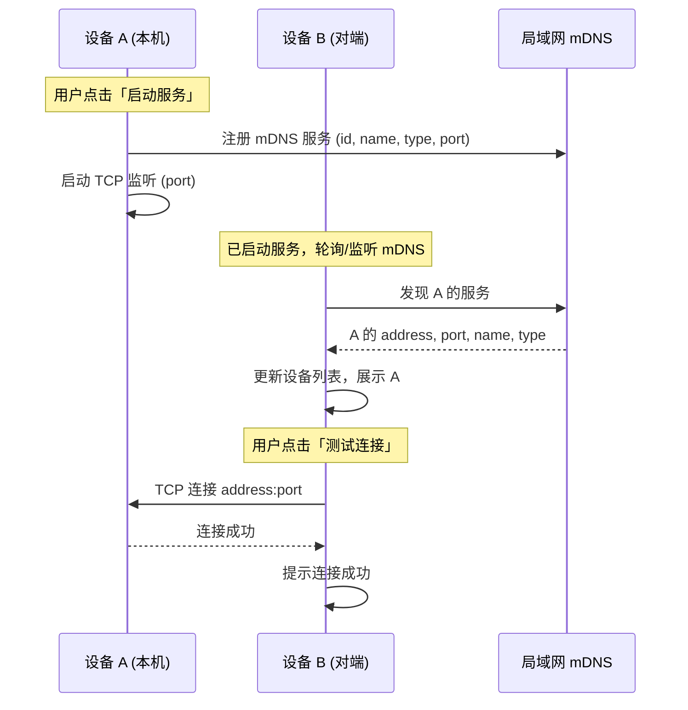
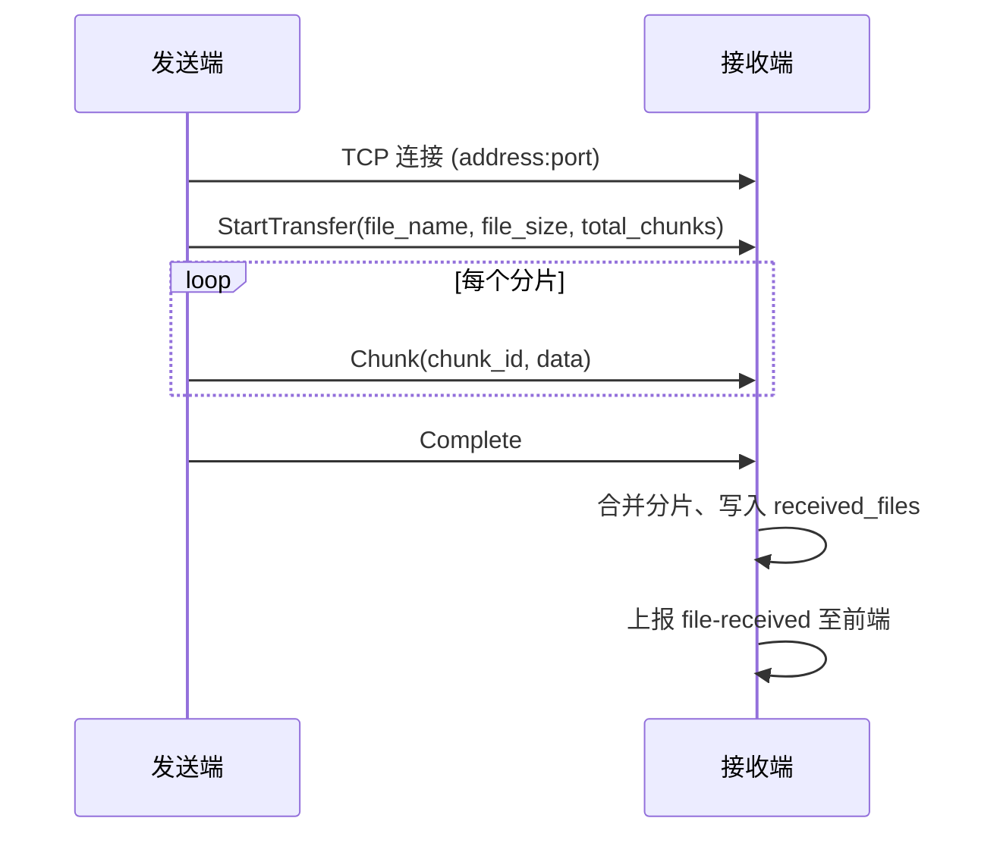
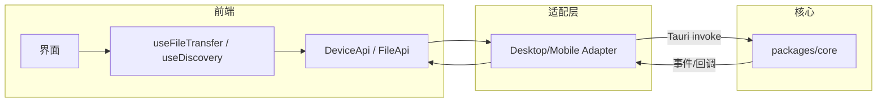

# 跨端文件传输共享方案设计

本文档描述 Stationuli 的**设备发现**与**P2P 文件传输**的跨端共享方案，与 [00-System-Design](./00-System-Design.md) 及 [PRD](../01-product/01-product-requirements-document.md) 中的相关需求对应。

## 目录

- [一、方案概述](#一方案概述)
- [二、设备发现](#二设备发现)
- [三、文件 P2P 传输](#三文件-p2p-传输)
- [四、跨端共享与适配](#四跨端共享与适配)
- [五、安全与性能](#五安全与性能)
- [六、扩展与演进](#六扩展与演进)
- [七、附录](#七附录)

---

## 一、方案概述

### 1.1 目标

- **设备发现**：在局域网内无中心、零配置地发现其他 Stationuli 设备，并支持手动添加与连接测试。
- **文件传输**：在已发现设备间建立 P2P 连接，可靠地发送与接收文件（含大文件分片、进度与完成通知）。
- **跨端一致**：Desktop 与 Mobile 共用同一套协议与业务抽象，通过 `packages/common` 与 `packages/core` 实现「一套逻辑、双端运行」。

### 1.2 设计原则

| 原则         | 说明                                                               |
| ------------ | ------------------------------------------------------------------ |
| **完全离线** | 不依赖公网与第三方服务，发现与传输均在局域网内完成。               |
| **协议统一** | 设备发现（mDNS）、传输（TCP + 自定义二进制协议）双端一致。         |
| **抽象分层** | 前端通过 DeviceApi/FileApi 与 core 交互，平台差异由 Adapter 消化。 |
| **可扩展**   | 预留断点续传、加密通道、多文件队列等扩展点。                       |

### 1.3 与 PRD / 系统设计的关系

- **PRD**：定义功能点（F-DISCO-_、F-DEV-_、F-FILE-\*）与业务规则。
- **00-System-Design**：定义模块边界（common / core）、数据流与部署形态。
- **本文**：在「设备发现 + 文件 P2P 传输」领域内细化协议、消息格式、跨端适配与实现约束。

---

## 二、设备发现

### 2.1 总体模型

- **发现方式**：mDNS 组播发现 + 手动添加（IP + 端口）。
- **服务形态**：每端在「启动服务」后注册 mDNS 服务并监听 TCP，对端通过 mDNS 解析到本机 IP:端口 或通过手动输入连接。
- **无中心**：无注册中心、无中继；发现与连接均在局域网内完成。

### 2.2 mDNS 设计

| 项目         | 说明                                                                                |
| ------------ | ----------------------------------------------------------------------------------- |
| **用途**     | 在局域网内广播本机「Stationuli 服务」的存在，并发现其他设备的服务。                 |
| **实现位置** | `packages/core` 的 p2p/mdns 模块。                                                  |
| **服务类型** | 使用统一的服务类型（如 `_stationuli._tcp`），便于过滤与识别。                       |
| **携带信息** | 服务注册与发现时携带：设备 ID、设备名称、设备类型（desktop/mobile/unknown）、端口。 |
| **刷新**     | 发现列表可定时刷新或由用户触发刷新；典型家庭/办公网下数秒内可见。                   |

### 2.3 设备模型与存储

- **设备信息**：至少包含 `id`、`name`、`address`（IP）、`port`、`device_type`（desktop/mobile/unknown）。
- **来源**：mDNS 发现的设备由 core 上报；手动添加的设备由用户填写 address、port，name/type/id 可选。
- **持久化**：设备列表存于前端 Store（Zustand），可选持久化到本地；不提交任何第三方。

### 2.4 连接测试

- **语义**：校验目标设备是否可达、端口是否开放。
- **实现**：对目标 `address:port` 发起 TCP 连接；成功即视为可用，超时或失败则提示用户。
- **用途**：在「发送文件」或「进入工作台」前可选执行，避免无效操作。

### 2.5 设备发现数据流

---

## 三、文件 P2P 传输

### 3.1 传输模型

- **连接方式**：发送方主动向接收方的 `address:port` 建立 TCP 连接；接收方在服务启动后持续监听同一端口，接受多路连接。
- **协议层次**：TCP 之上为应用层自定义二进制协议（序列化格式由 core 定义，如 serde）；消息类型见下。
- **单文件顺序**：一次传输内消息顺序固定：`StartTransfer` → `Chunk`×N → `Complete`（或出错时 `Error`）。

### 3.2 消息类型与格式

与 `packages/core` 中 `file/transfer` 模块一致，传输消息可抽象为：

| 消息类型          | 方向      | 含义           | 主要字段/说明                      |
| ----------------- | --------- | -------------- | ---------------------------------- |
| **StartTransfer** | 发送→接收 | 开始一次传输   | file_name, file_size, total_chunks |
| **Chunk**         | 发送→接收 | 一个分片       | chunk_id, data（二进制）           |
| **Complete**      | 发送→接收 | 本文件传输结束 | 无额外负载                         |
| **Error**         | 双向      | 传输错误       | 错误信息字符串，可断开连接并提示   |

- **分片大小**：默认 1MB（可配置），避免大文件单次加载导致内存压力；见 core 中 `FileTransfer::chunk_size` 与 `file/chunk`。
- **序列化**：由 core 统一做序列化/反序列化，保证双端解析一致。

### 3.3 发送流程

1. 用户在选择文件后指定目标设备（或在工作台内默认当前设备）。
2. 前端通过 FileApi 调用 core 的发送接口（如 `send_file` / `send_file_with_progress`），传入文件路径或 content URI、目标 address、port。
3. Core 建立 TCP 连接 → 发送 `StartTransfer` → 按序发送各 `Chunk` → 发送 `Complete`；可选上报进度（已发送字节数 / 总字节数）给前端。
4. Desktop：文件路径为本地路径；Mobile（Android）：可为 content URI，需在 Tauri 层或适配层先按 URI 读取为流/字节再交给 core，core 侧不直接依赖 Tauri（见 PRD F-FILE-E06 与跨端适配节）。

### 3.4 接收流程

1. 服务启动后，core 在监听端口上接受 TCP 连接；每路连接独立处理。
2. 接收端按协议解析消息：收到 `StartTransfer` 后创建或选定本次传输的上下文，按 `chunk_id` 缓存 `Chunk`，收到 `Complete` 后合并分片、落盘、上报 `file-received` 事件（含 file_path、file_name 等）给前端。
3. 落盘目录：应用数据目录下的 `received_files`；同名文件策略以实现为准（如追加序号或覆盖）。
4. 前端在「接收的文件」区域展示列表，支持另存到用户指定位置、删除记录、查看详情。

### 3.5 文件传输数据流

---

## 四、跨端共享与适配

### 4.1 共享层职责（packages/common）

| 内容             | 说明                                                                                                                                                |
| ---------------- | --------------------------------------------------------------------------------------------------------------------------------------------------- |
| **DeviceApi**    | startDiscovery、stopDiscovery、getDevices、addDevice、editDevice、deleteDevice、testConnection 等抽象；各端通过 Adapter 调用 core（Tauri invoke）。 |
| **FileApi**      | selectFile、getFileName、getFileSize、sendFile、saveReceivedFile 等；同上，由各端实现具体选源（系统对话框 / content URI）。                         |
| **Hooks**        | useDiscovery、useDeviceDiscovery、useFileTransfer 等，封装状态与 API 调用。                                                                         |
| **组件**         | ServiceStatusCard、DeviceCard、AddDeviceDialog、ReceivedFilesCard 等，通过 variant（desktop/mobile）区分布局与样式。                                |
| **类型与 Store** | DeviceInfo、ReceivedFile、设备列表与接收文件列表的 Zustand store。                                                                                  |

### 4.2 核心层职责（packages/core）

| 模块              | 职责                                                                        |
| ----------------- | --------------------------------------------------------------------------- |
| **p2p/mdns**      | mDNS 服务注册与发现，维护设备列表（id、name、address、port、device_type）。 |
| **p2p/tcp**       | TCP 监听与连接，供文件传输与测试连接使用。                                  |
| **file/chunk**    | 分片与合并逻辑（split_file、merge_chunks）。                                |
| **file/transfer** | 发送/接收流程、TransferMessage 序列化、进度回调与事件。                     |

### 4.3 平台差异与适配

| 维度         | Desktop                       | Mobile (Android)                                          |
| ------------ | ----------------------------- | --------------------------------------------------------- |
| **文件选择** | 系统文件对话框，得到本地路径  | 系统选择器或 content URI；大文件/流式见 F-FILE-E06 设计。 |
| **文件读取** | core 直接按路径读             | content URI 需在 Tauri/适配层转为字节或流再交 core。      |
| **接收目录** | 应用数据目录 received_files   | 同上；另存时走系统保存对话框或 SAF。                      |
| **UI 变体**  | variant=desktop（侧栏、顶栏） | variant=mobile（底栏、顶栏）。                            |

- **Content URI**：Android 上选择相册/文档等可能返回 content URI；当前 core 不直接处理 content URI，由调用方（Tauri 或 common 的 Adapter）负责读取后传入 core，避免 core 依赖平台 API。

### 4.4 端到端调用链（概念）

---

## 五、安全与性能

### 5.1 安全

- **范围**：发现与传输仅在用户可控的局域网与本机进行；本机 IP、设备 ID、端口等不向非用户指定服务上传。
- **加密**：端到端加密（X25519 + AES-256）在 core 的 crypto 模块已有设计/实现，与传输链路的完整集成按版本推进；本文不改变「无第三方」前提。
- **敏感信息**：设备列表、接收文件路径等仅存本地；若未来做持久化，需避免明文暴露于不可信存储。

### 5.2 性能

| 项目         | 要求/建议                                                                                  |
| ------------ | ------------------------------------------------------------------------------------------ |
| **发现时延** | 典型家庭/办公网下，设备应在数秒内出现在发现列表；mDNS 与轮询间隔需权衡刷新频率与负载。     |
| **大文件**   | 采用分片（如 1MB）传输，避免单次整文件加载导致 OOM。                                       |
| **反馈**     | 启停服务、测试连接、发送/接收文件均有加载态与结果反馈（禁用按钮、Progress、Toast/Alert）。 |

### 5.3 错误与边界

- **连接超时**：测试连接与发送连接需设置合理超时，并提示用户。
- **传输中断**：连接断开或收到 `Error` 时，接收端丢弃未完成的本次传输上下文；发送端可提示失败并支持重试（队列与重试策略见扩展节）。
- **同名文件**：接收目录下同名文件的覆盖/重命名策略以当前实现为准，后续可在 PRD 中明确。

---

## 六、扩展与演进

### 6.1 已规划（与 PRD 一致）

- **传输历史与操作日志**：记录发送/接收、目标设备、时间、结果等，在历史页展示。
- **多文件队列**：多选文件发送时的队列管理、取消、重试。
- **进度与体验**：发送/接收过程展示进度条、速度、预计剩余时间；接收列表展示发送方信息（设备名、IP、类型）。
- **断点续传**：大文件中断后可从断点续传；core 已有 resume 相关结构，端到端打通依版本实现。
- **Android content URI 与流式**：完整方案见 PRD F-FILE-E06 及后续专项设计。

### 6.2 协议扩展原则

- 新增消息类型时，保持向后兼容：未知类型可忽略或按「错误」安全处理。
- 加密通道与现有 TCP 传输的关系：可在 TCP 之上增加一层加密封装，对现有 StartTransfer/Chunk/Complete 语义透明。

---

## 七、附录

### 7.1 参考文档

- [00-System-Design](./00-System-Design.md) — 整体系统设计
- [PRD - 产品需求文档](../01-product/01-product-requirements-document.md)
- [02-design README](./README.md)

### 7.2 相关代码路径

| 层级     | 路径/说明                                                                                |
| -------- | ---------------------------------------------------------------------------------------- |
| 核心发现 | `packages/core/src/p2p/mdns.rs`                                                          |
| 核心传输 | `packages/core/src/p2p/tcp.rs`、`file/transfer.rs`、`file/chunk.rs`                      |
| 共享抽象 | `packages/common` 内 DeviceApi、FileApi、useDiscovery、useFileTransfer、相关组件与 Store |
| 应用入口 | `apps/desktop`、`apps/mobile` 中调用 common 与 Tauri invoke core                         |

### 7.3 术语速览

| 术语              | 说明                               |
| ----------------- | ---------------------------------- |
| mDNS              | 组播 DNS，局域网设备发现           |
| StartTransfer     | 文件传输协议：开始一次传输         |
| Chunk             | 文件传输协议：一个分片             |
| Complete          | 文件传输协议：本次传输结束         |
| received_files    | 应用数据目录下存放接收文件的子目录 |
| DeviceApi/FileApi | common 中设备与文件能力的接口抽象  |
