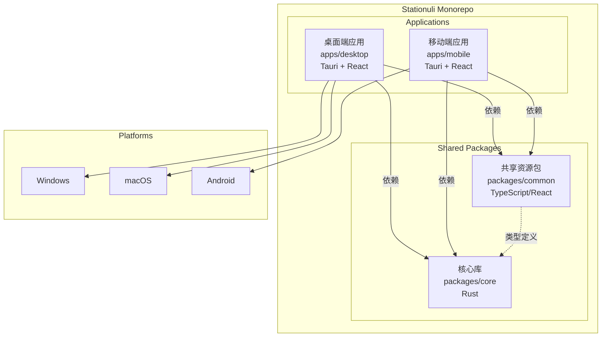
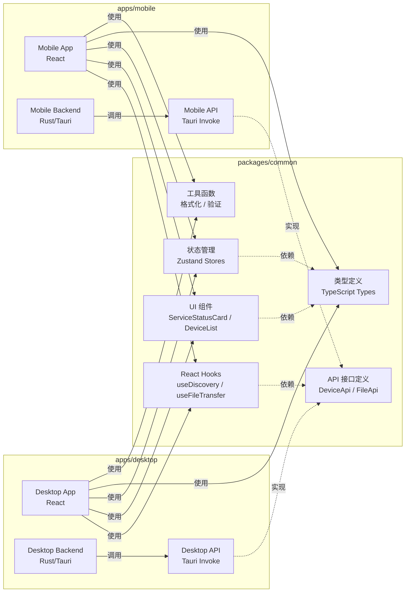
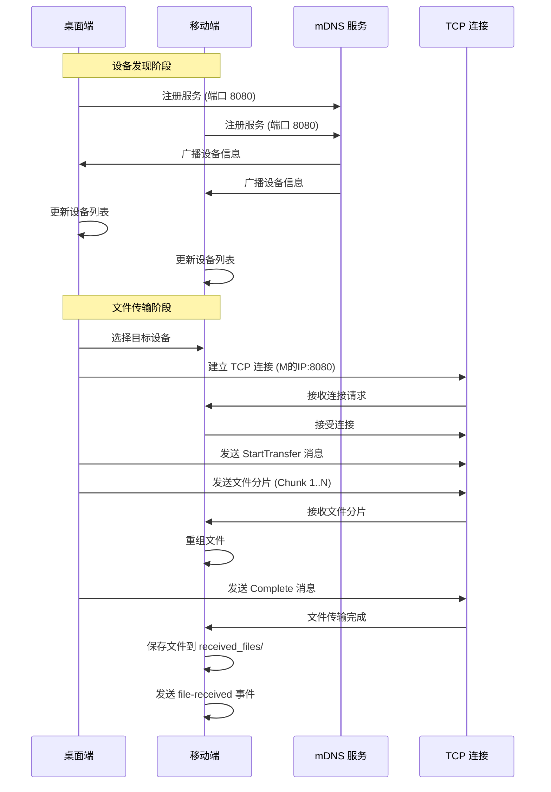
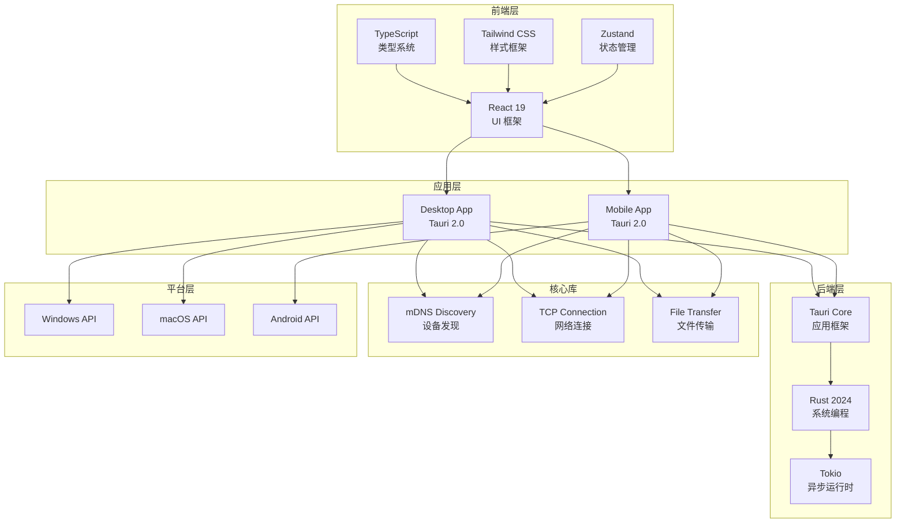
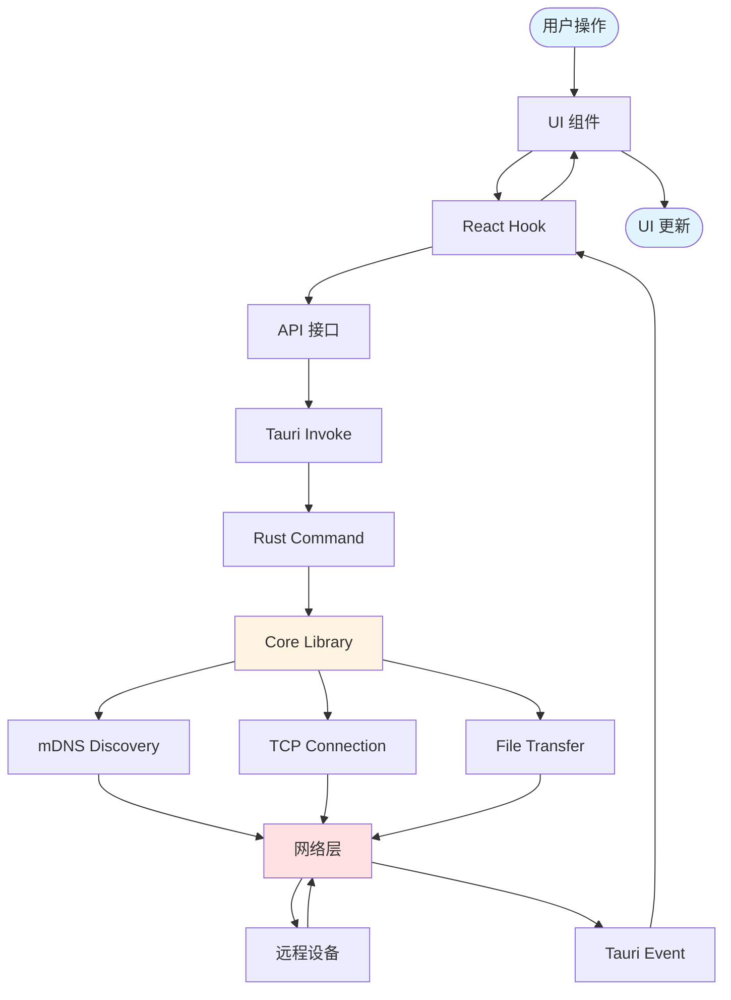

# Stationuli 设计文档

本目录包含 Stationuli 项目的核心设计文档。

## 整体架构设计

### 1. 项目整体架构

### 2. 跨平台资源共享架构

### 3. 设备发现和文件传输架构

### 4. 技术栈架构

### 5. 数据流架构

## 文档列表

### 1. [跨平台资源共享设计方案](./cross-platform-resource-sharing.md)

详细说明如何通过 `packages/common` 包实现桌面端和移动端之间的资源共享，包括：

- 架构设计
- 资源共享层次（API 接口、React Hooks、UI 组件、状态管理、类型定义）
- 平台适配策略
- 依赖管理
- 构建和打包流程
- 最佳实践

### 2. [设备发现和文件传输设计文档](./device-discovery-and-file-transfer.md)

详细说明设备发现和文件传输的实现机制，包括：

- 整体架构
- mDNS 设备发现原理和实现
- TCP 文件传输协议
- 文件分片和重组
- 平台特定处理（Android content URI）
- 错误处理和性能优化
- 安全考虑

## 相关资源

- **代码仓库**：`packages/common/` - 共享资源包
- **核心库**：`packages/core/` - Rust 核心库
- **桌面端**：`apps/desktop/` - 桌面端应用
- **移动端**：`apps/mobile/` - 移动端应用

## 更新日志

- **2025-12-02**：初始版本，创建跨平台资源共享和设备发现/文件传输设计文档
